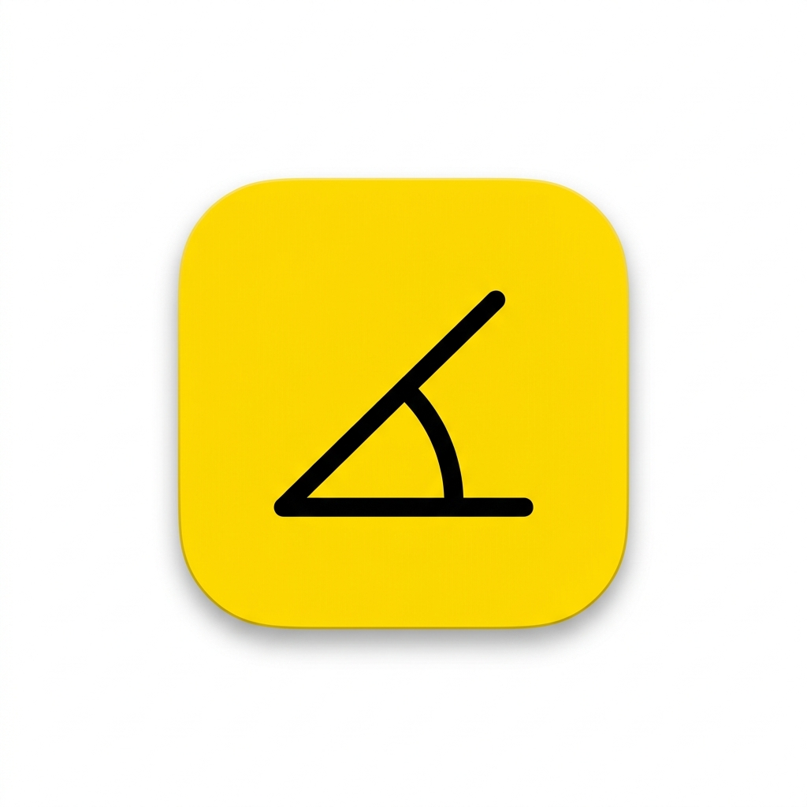
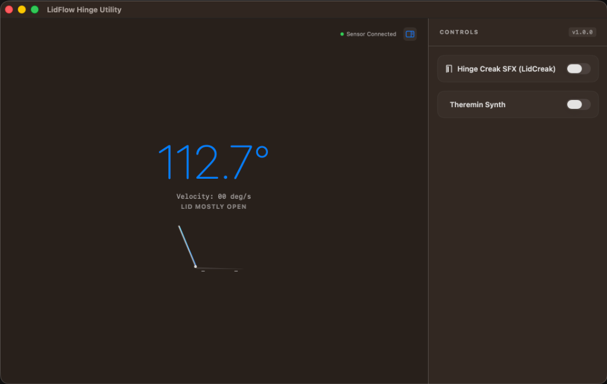

# LidFlow 📐🚪🎵

<p align="center">
  
</p>

**LidFlow** is a premium, lightweight macOS utility designed for MacBook models. It reads the raw data from the built-in MacBook lid angle sensor in real-time and converts physical hinge movements into custom synthesized audio feedback and animations.

It features:
1. **Real-Time Hinge Visualizer**: Displays the exact hinge angle in degrees with a beautiful side-profile outline of a MacBook that folds and opens in sync with your actual lid.
2. **LidCreak (Creaky Hinge SFX)**: Plays a premium recorded squeaking/creaking door sound as you move the MacBook lid, dynamically mapping hinge speed to play rate and volume in real-time.
3. **LidTheremin (Screen Synth)**: Turns your screen into a musical instrument. Adjusting the screen angle sweeps the pitch of a real-time synthesized sine, triangle, or sawtooth wave. Features volume decay when stationary.

<p align="center">
  
</p>

<p align="center">
  
  
  
</p>

---

## 🛠️ Build and Run

To compile and package the app into a standalone macOS `.app` bundle:

1. Clone or download this repository.
2. Open terminal in the directory and make the build script executable:
   ```bash
   chmod +x build_app.sh
   ```
3. Run the build script:
   ```bash
   ./build_app.sh
   ```
4. Double-click and open the generated **`LidFlow.app`** in the project directory!

---

## ⚙️ Architecture

* **UI**: SwiftUI + AppKit windowing.
* **Sensor**: Interfaces with the Apple hardware sensor via IOKit HID matching:
  - **Vendor ID**: `0x05AC` (Apple)
  - **Product ID**: `0x8104` (Lid Angle Sensor)
  - **Usage Page**: `0x0020` (Sensor)
  - **Usage**: `0x008A` (Orientation)
* **Sound Engine**: 
  - **Door Sounds**: Synthesized PCM WAV buffers generated mathematically at runtime.
  - **Theremin Synth**: Real-time sine/triangle/sawtooth wave oscillators generated on-demand using `AVAudioEngine` and `AVAudioSourceNode`.

---

## ⚠️ Requirements & Compatibility

* Requires a **MacBook model with a lid angle sensor** (most MacBook Pros from 2019 onwards, and all Apple Silicon MacBook Airs/Pros).
* Requires **macOS 13.0 (Ventura) or later**.
* Because the app utilizes low-level private HID APIs to read sensor data, it must run **outside** of the macOS App Sandbox. The packaging script handles configuring this automatically.

---

## 📄 License

This project is licensed under the MIT License.
